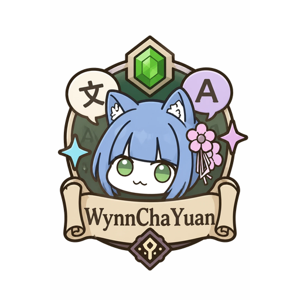

<p align="center">
  
</p>

# WynnChaYuan

English: **[README.en.md](README.en.md)**

Wynncraft 繁體中文翻譯模組。**不取代原文**——譯文顯示在旁邊的獨立面板，
原本的畫面完全不動。

## 為什麼不直接把文字換成中文

Wynncraft 是多人遊戲。畫面上只剩中文的話，跟其他玩家討論「去找 Blacksmith」時
就對不上話——老玩家只認得英文名。而且遊戲的排版大量依賴材質包符號與
不可見的對齊字元，直接替換很容易破圖。

所以這個模組**預設**的做法是：**原文留著，譯文另外顯示**。

| 內容 | 呈現方式 |
|---|---|
| 物品 tooltip | 旁邊另開一塊翻譯面板 |
| NPC 名牌、漂浮字 | 注視時在準心下方跳一個小框（原文不動） |
| 任務對話 | 畫面下方的獨立小框 |
| 任務追蹤 | 畫面左側的獨立小框 |

如果不需要對照英文，F6 的「物品翻譯」可以改成**就地取代**，
譯文直接寫進原本的 tooltip，畫面比較乾淨。兩種模式用的是同一套
逐片段替換，圖示、顏色與欄位對齊都一樣保真。

## 這個模組做了什麼

| 內容 | 呈現方式 |
|---|---|
| 物品 tooltip | 旁邊另開一塊翻譯面板，或直接寫進原本的 tooltip（可切換） |
| 任務對話 | 譯文寫進 **Wynncraft 自己那個對話框**，框、名牌、頭像原樣保留 |
| NPC 名牌、漂浮字 | 關閉／注視時跳小框／就地取代（可切換）。工作站、「空手右鍵」那些浮在世界裡的字都算 |
| 任務追蹤 | 畫面左側的獨立小框 |
| 技能樹 | 每個節點、說明與流派 |
| 系統訊息 | 任務完成、獎勵清單、進出區域那些聊天訊息 |
| 複製聊天 | 列出最近的聊天訊息，點一則複製（按鍵預設沒綁） |
| 譯文截圖 | **F9** 把翻譯面板拍下來，複製到剪貼簿或存成檔案（可改綁） |

## 安裝

需要 [Wynntils](https://modrinth.com/mod/wynntils)（4.2 以上）與 Fabric API。

把 jar 放進 `mods/`，進遊戲按 **F6** 開設定。
首次啟動會自動在 `config/wynnchayuan/translations/` 產生翻譯工作檔。

## 參與翻譯

<!-- 進度:開始 -->
更新於 2026-08-30。

| 語言 | 進度 | 已翻 / 總數 |
|---|---|---:|
| `zh_tw` 繁體中文 | ████████░░ 75.3% | 20,658 / 27,445 |
| `de_de` Deutsch | ░░░░░░░░░░ 0.0% | 0 / 26,765 |
| `es_es` Español | ░░░░░░░░░░ 0.0% | 0 / 26,765 |
| `fr_fr` Français | ░░░░░░░░░░ 0.0% | 0 / 26,765 |
| `ja_jp` 日本語 | ░░░░░░░░░░ 0.0% | 0 / 26,765 |
| `ko_kr` 한국어 | ░░░░░░░░░░ 0.0% | 0 / 26,765 |
| `ru_ru` Русский | ░░░░░░░░░░ 0.0% | 0 / 26,765 |
| `zh_cn` 简体中文 | ░░░░░░░░░░ 0.0% | 0 / 26,765 |

每一種語言**還缺哪些檔案**見 [docs/PROGRESS.md](docs/PROGRESS.md)。<br>Per-language breakdown: [docs/PROGRESS.md](docs/PROGRESS.md).
<!-- 進度:結束 -->

非常歡迎幫忙。
完整說明見 [CONTRIBUTING.md](CONTRIBUTING.md)——**不需要會寫程式**，
在 GitHub 網頁上直接改就行。專有名詞先查 [GLOSSARY.md](GLOSSARY.md)
（`Reflection` 是「遠程反傷」不是「反射」那類）。

> **想加入翻譯團隊，或想知道最近改了什麼**：[給翻譯團隊](docs/for-translators.md)
> ——技能名稱只翻一次、`{~1}` 指名數值、詞條的三種寫法。

翻譯檔就是純 JSON，只要填 `dst`：

```json
"a1b2c3": {
  "src": "Combat Level",
  "dst": "戰鬥等級",
  "role": "name",
  "ctx": ["gear/weapon"]
}
```

改完存檔，在遊戲內按 **F6 → 重新載入譯文檔**即可生效，不用重開遊戲。

### 譯文從哪裡來

預設 **GitHub**：進遊戲時從這個 repo 同步最新譯文，所以譯者的 PR 合併後，
所有人下次進遊戲就更新了，**模組本身不必重新發布**。

抓不到就用上次的快取，沒有快取就用 jar 內建的版本——斷網或 GitHub 掛掉
只是「沒有最新的」，不會變成沒有翻譯。

想自己試譯時，F6 把「譯文來源」切成**本機**，就只讀 config 目錄下的檔案。

裝備依類型拆成三個檔（武器／防具／飾品），這樣多人同時翻不同類別不會衝突。

### 檔案分工

| 檔案 | 內容 | 來源 |
|---|---|---|
| `ui-labels.json` | 介面標籤 | 手寫 |
| `gear-weapon.json` `gear-armour.json` `gear-accessory.json` | 裝備名稱與傳說敘述 | 官方 CDN |
| `ability.json` | 技能 | 官方 CDN |
| `ingredient.json` `material.json` `tome.json` `aspect.json` `charm.json` | 材料等 | 官方 CDN |

前者手寫，後者由 `tools/build.py` 從官方資料生成——**重跑會保留已填的 `dst`**，
所以遊戲改版後可以安全地重新生成。

### 佔位符

遊戲送來的字裡有幾種東西不該由譯者填：材質包畫的符號、遊戲當下算出來的數值、
玩家自己的名字。這些抽成佔位符，**譯文裡必須原樣保留，位置可依中文語序調整**：

| 佔位符 | 代表 | 範例 |
|---|---|---|
| `{#}` | 材質包符號 | `{#} Mana Cost: {~}` → `{#} 魔力消耗: {~}` |
| `{~}` | 數值 | `- +{~} Emeralds` → `- +{~} 綠寶石` |
| `{~1}`–`{~9}` | 指名第幾個數值（語序要換的時候用） | `+{~} to {~}` → `{~2} 提升 {~1}` |
| `{p}` | 地名（永遠不翻） | `{p} Citizen` → `{p} 市民` |
| `{u}` | 玩家自己的名字 | `Great job, {u}!` → `做得好，{u}！` |

`{p}` 讓 137 個地名共用同一條譯文，也保證地名不會被翻掉。
**佔位符數量對不上時整行會放棄翻譯**——寧可顯示原文，也不要畫出錯位的東西。

另有一組**顏色佔位符**，只寫在譯文、`src` 不能有。譯文的顏色平常是拿原文有顏色的
那一段去比對字面猜出來的，翻成中文就對不上，那一段會掉回底色；這組佔位符讓譯者
直接寫出答案：

| 寫法 | 意思 |
|---|---|
| `{c1}`–`{c9}` | 用原文的第 N 個顏色（依第一次出現的順序） |
| `{c:#FF55FF}` | 自己指定色碼 |
| `{c:gold}` | 自己指定原版顏色名稱（Minecraft 那十六個） |
| `{/}` | 到此為止，回到這一段原本的顏色 |

```json
"src": "[Cave Completed]\nGrook's Nest",
"dst": "{c1}[洞穴完成]{/}\n{c2}Grook 巢穴{/}"
```

完整規則、編號怎麼查、常見錯誤，見 [CONTRIBUTING.md](CONTRIBUTING.md)。

## 建置

```bash
gradle build
```

Wynntils 只發佈到 Modrinth／CurseForge，沒有 Maven 座標，所以要**自行下載
fabric 版**放進 `libs/`（不隨本專案散布）。少了它建置會直接停下並說明該怎麼做。

> 不要改用 `maven.modrinth:wynntils:v4.2.8`——看起來可行，實測會抓到 NeoForge 版：
> Modrinth 上 fabric 與 neoforge 共用同一個 version_number。

`gradle build` 會自動跑三組驗證：符號判斷、翻譯來回、以及
「Python 語料工具與 mod 端算出相同模板」的一致性比對。最後這項尤其重要——
兩邊規則只要有一點差異，遊戲裡就會靜默查不到譯文。

## 工具

```bash
python tools/progress.py              # 翻譯進度
python tools/progress.py --next 30    # 建議接下來翻哪些
python tools/merge_captured.py <captured.json>   # 併入玩家收集到的字串
```

## 重新生成語料

```bash
python tools/fetch.py    # 從官方 CDN 下載
python tools/build.py    # 抽取、分類、參數化 → 工作檔
```

## 團隊

同一份名單也顯示在遊戲內（**F6 → 關於／貢獻者**），含 Minecraft 頭像。
名單上的人，**名牌上方會多一行標記**——顏色依身分，身分不只一種的會漸層，
三種都有的是彩虹。只有裝了本模組的人看得到，可在同一頁關掉。

要加人只要改 [`credits.json`](src/main/resources/assets/wynnchayuan/credits.json)，不必動程式。

<!-- credits:begin -->

<!-- 這一段由 tools/sync-credits.py 從 credits.json 產生，不要手動改。 -->

### 開發者

| 名稱 | Minecraft ID |
|---|---|
| LyuChaCha | `Green_teaTW` |
| 芋圓YuYuan | `s103064` |

### 贊助者

| 名稱 | Minecraft ID |
|---|---|
| LyuChaCha | `Green_teaTW` |
| ㄉ綠 | `MlyuL` |

### 貢獻者

| 名稱 | Minecraft ID |
|---|---|
| SCPNightsky | `SCP_Night_sky` |
| LyuChaCha | `Green_teaTW` |
| Pure | `21_Pure` |
| 泥巴先生 | `MrMud8033112` |
| 幻影Joker | `NOT_Joker` |
| Pootato | `Pootato__` |
| N02sAyLa | `eric18960` |
| 鳥鳥 | `Smellybird_` |
| 98 | `Jackandmina98` |
| Jimmy | `0110jimmy` |
| 雪花 | `ThEsnowF` |
| Roy | `aaroye` |
| Chq | `Chqrish` |
| EnderChan2580 | `Enderchen2580` |

### 資料來源

| 名稱 | Minecraft ID |
|---|---|
| Wynntils（物品／技能 CDN） | — |
| Wynncraft | — |

翻一條就會出現在這裡。見 [CONTRIBUTING.md](CONTRIBUTING.md)。

<!-- credits:end -->

## 資料來源與致謝

- 物品與技能資料取自 [Wynntils](https://github.com/Wynntils/Wynntils) 使用的公開 CDN
- 材質包符號與排版由 Wynncraft 提供，本模組僅顯示、不修改
- 對話框裡的中日韓字形使用 [Fusion Pixel 10px](https://github.com/TakWolf/fusion-pixel-font)
  比例模式（SIL OFL 1.1，授權全文見 `assets/wynnchayuan/font/OFL-fusion.txt`）。
  它的大寫高度正好 7 像素，跟 Wynncraft 對話框的英文同高。
  字型<b>按語言分</b>：同一個碼位在不同地區的寫法不一樣，目前只附繁體中文（`zh_tw`），
  其他語言開始翻譯對話時再各自加上。點陣字沒有哪一套是全的，所以譯文只要有一個字
  畫不出來，那一段就維持原文而不是畫出方框

## 授權

[MIT](LICENSE)
